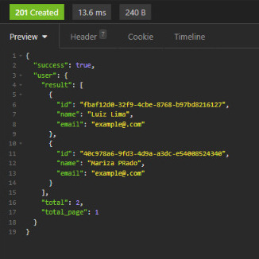

# FILTER LIST DOCUMENT

**O nosso guia básico de como utilizar o filtro de busca em uma aplicação feita em NodeJS + Typescript + Typeorm**

### INSTALANDO APLICAÇÃO

```bash
$ yarn install
# or
$ npm install
```

### STARTANDO APLICAÇÃO

```bash
$ yarn dev
# or
$ npm dev
```

### ENDPOINTS

```bash
GET - http://localhost:5000/users
POST - http://localhost:5000/users
```

### JSON

```
{
  "name": "Luiz Lima",
  "email": "example@hotbail.com"
}
```

Vamos mostrar aqui um exemplo para qual o desenvolvedor já entende o fluxo da aplicação, já entende como funcionam as ferramentas usadas para esse exemplo de API, será mostrado um overview de como é implementado o filtro em uma busca de usuários.

- Considere que essa documentação pode com o tempo ser mais específica.
- Este repositório ainda está em andamento.

Vamos nessa!

#### 1 - HELPERS

Aqui inicialmente vamos mostrar como é a estrutura que nos possibilita fazer o filtro. Nesse caso, sendo mais resumido vamos pegar apenas o método de build criado nessa classe, veja como ficou:

```bash
# src/helpers/filter/typeorm/filterBuilder/index.ts
export interface IFilterQuery extends IFilter, IPage, IOrder {}

export default class FilterBuilder<Entity> {
  private readonly queryBuilder: SelectQueryBuilder<Entity>;

  constructor(
    entityRepository: Repository<Entity>,
    private query: IFilterQuery,
    private alias: string
  ) {
    this.queryBuilder = entityRepository.createQueryBuilder(alias);

    if (query.orderBy) {
      this.verifyColumnExists(query.orderBy, entityRepository);
    }

    query.filterBy.forEach((filterItem) =>
      this.verifyColumnExists(filterItem, entityRepository)
    );
  }

  build(): SelectQueryBuilder<Entity> {
    const whereBuilder = new WhereBuilder<Entity>(
      this.queryBuilder,
      this.query,
      this.alias
    );
    whereBuilder.build();

    const orderBuilder = new OrderBuilder<Entity>(
      this.queryBuilder,
      this.query,
      this.alias
    );
    orderBuilder.build();

    const pageBuilder = new PageBuilder<Entity>(this.queryBuilder, this.query);
    pageBuilder.build();

    return this.queryBuilder;
  }
}
```

#### 2 - REPOSITORY

Em seguida, vamos chamar esse método no nosso repository de usuário, sendo ele criado como **usersRepository**. Considerando que já sabemos como é o processo de criar uma entidade e uma interface na qual essa classe faz a implementação, vamos dar seguimento ao método de busca que será implementado da seguinte maneira:

```bash
# src/modules/users/http/typeorm/repository/usersRepository.ts
export class UsersRepository implements IUsersRepository {
  private ormRepository: Repository<Users>;

  constructor() {
    this.ormRepository = getRepository(Users);
  }

  // Chamo um parâmetro de filtro e utilizo o método criado no exemplo anterior
  public async findAll(query: IFilterQuery): Promise<[Users[], number]> {
    const filterQueryBuilder = new FilterBuilder<Users>(
      this.ormRepository,
      query,
      "users"
    );

    const queryBuilder = filterQueryBuilder.build();
    const result = await queryBuilder.getManyAndCount();

    return result;
  }
}
```

#### 3 - USECASE

Indo para o nosso usecase, o nosso método de busca será implementado da seguinte maneira:

```bash
# src/modules/users/usecases/findAllUsers/findAllUsecase.ts
export interface IResponse {
  total: number;
  total_page: number;
  result: Users[];
}

@injectable()
export class FindAllUsersUseCase {
  constructor(
    @inject('UsersRepository')
    private usersRepository: IUsersRepository,
  ) {}

  public async execute(query: IFilterQuery): Promise<IResponse> {
    const [result, total] = await this.usersRepository.findAll(query);

    // aqui digo para esse método de como espero que seja o meu retorno na busca de usuários
    const response: IResponse = {
      result,
      total,
      total_page: Math.ceil(total / query.per_page),
    };

    return response;
  }
}
```

#### 4 - CONTROLLERS

Em nosso controller, considerando que já conhecemos a estrutura e ferramentas que utilizamos dentro desse método, ficaria da seguinte maneira:

```bash
## src/modules/users/usecases/findAllUsers/findAllUsersControllers.ts

export class FindAllUsersController {
  async handle(request: Request, response: Response): Promise<Response> {
    const createUserUseCase = container.resolve(FindAllUsersUseCase);
    const user = await createUserUseCase.execute(
      parseQueryFilters(request.query)
    );

    return response
      .status(201)
      .json({ success: true, user: classToClass(user) });
  }
}
```

#### 5 - INSOMNIA

Nessa parte, basicamente quando eu for criar um usuário e depois for fazer uma busca geral, vamos ver que ele irá retornar da maneira que planejamos conforme foram feitos todos os passos até aqui. Aqui vamos ter um exemplo de como ele será retornado no Insomnia:



#### Considerações finais

Para entender melhor o fluxo exato de como funciona, temos como esse repositório um exemplo para que você possa ir mais a fundo vendo o processo mais detalhado, podendo assim extrair o máximo de aprendizado o possível.

Esse projeto foi feito com muito carinho, deixe sua estrelinha se você gostar dessa ajuda <3

Luiz Lima.
